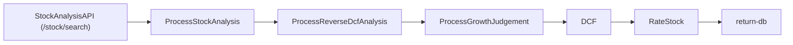

# Backend Analysis Workflow (Motia Legacy Baseline)

Last updated: 2026-02-26
Scope: documents current `apps/backend` Motia stock-analysis behavior before Module 1 pruning.

## 1) Trigger Entrypoint and Contracts

- HTTP trigger: `GET /stock/search`
  - Source: `apps/backend/steps/stock-analysis/stock-analysis-api.step.ts`
  - Query param: `symbol` (required, non-empty string via `z.string().min(1)`)
  - Side effect: emits event topic `process-stock-analysis` with payload `{ symbol }`
  - Response: `{ message, status: "processing", traceId }`
- Flow ID used by steps: `stock-analysis-flow`
- Runtime/infra config: `apps/backend/motia.config.ts` with plugins:
  - observability, states, endpoint, logs, bullmq

## 2) End-to-End Step Graph (Current Ordered Runtime Chain)

Event topics across this chain:

1. `process-stock-analysis`
2. `finish-stock-qualitative-analysis`
3. `finish-reverse-dcf-analysis`
4. `finish-growth-judgement`
5. `finish-dcf`
6. `finish-stock-rating`

## 3) Step-by-Step Behavior and Transition Conditions

### A. `ProcessStockAnalysis` (`qualitative-analysis.step.ts`)

- Subscribes: `process-stock-analysis`
- Emits: `finish-stock-qualitative-analysis`
- Calls `qualitativeStockAnalysis(symbol)` (Gemini + Google Search tool)
- Stream updates:
  - `"Gemini is analyzing the stock..."`
  - `"Gemini has finished analyzing the stock."`
- State write key: `stock-qualitative-analysis`
  - `{ symbol, thesis, reasoning, generatedAt }`
- Transition condition:
  - success -> emit `finish-stock-qualitative-analysis`
  - error -> throws (no local retry handling in step)

### B. `ProcessReverseDcfAnalysis` (`reverse-dcf.step.ts`)

- Subscribes: `finish-stock-qualitative-analysis`
- Emits: `finish-reverse-dcf-analysis`
- Data fetch:
  - `fetchQuote(symbol)` -> quote endpoint
  - `fetchFinancialReportData(symbol)` -> FMP statement endpoints and TTM aggregation
- Computes reverse DCF via `reverseDcf(...)`:
  - discount-rate scenarios `[0.06, 0.07, 0.08, 0.09, 0.10]`
  - implied growth found by binary search per scenario
- Stream updates:
  - `"Fetching current stock price and market data..."`
  - `"Fetching trailing twelve months financial data..."`
  - `"Calculating implied growth rates across discount rates..."`
  - success: `"Reverse DCF analysis completed successfully."`
  - failure: `"Reverse DCF failed: <message>"`
- State write key: `reverse-dcf-analysis`
  - includes quote + TTM + implied growth rates + `generatedAt`
- Transition condition:
  - success -> emit `finish-reverse-dcf-analysis`
  - error -> stream failure status + throw

### C. `ProcessGrowthJudgement` (`judgement.step.ts`)

- Subscribes: `finish-reverse-dcf-analysis`
- Emits: `finish-growth-judgement`
- Reads validated state:
  - `stock-qualitative-analysis` (schema validated)
  - `reverse-dcf-analysis` (schema validated)
- Calls `evaluateGrowthFeasibility(...)` (Gemini structured output)
- Stream updates:
  - `"Retrieving qualitative analysis and reverse DCF results..."`
  - `"AI is judging the feasibility of implied growth rates..."`
  - `"Growth feasibility judgement completed."`
- State write key: `growth-judgement`
- Transition condition:
  - success -> emit `finish-growth-judgement`
  - missing/invalid state or AI errors -> throw

### D. `DCF` (`dcf.step.ts`)

- Subscribes: `finish-growth-judgement`
- Emits: `finish-dcf`
- Reads validated state:
  - `growth-judgement`
  - `reverse-dcf-analysis`
- Core logic:
  - uses AI 5-year growth rates
  - extends to 10-year profile by linear fade to terminal growth
  - runs base DCF and 5x5 sensitivity matrix:
    - discount +/-1% in 0.5% steps
    - terminal growth +/-0.5% in 0.25% steps
- Stream updates:
  - `"Calculating DCF from AI projections..."`
  - `"DCF calculation and sensitivity analysis completed."`
- State write key: `dcf`
- Transition condition:
  - success -> emit `finish-dcf`
  - compute error -> throw

### E. `RateStock` (`rating.step.ts`)

- Subscribes: `finish-dcf`
- Emits: `finish-stock-rating`
- Reads validated state:
  - `dcf`
  - `stock-qualitative-analysis`
  - `growth-judgement`
- Calls `rateStock(...)` (Gemini structured rating)
- Stream updates:
  - `"Gemini is generating stock rating..."`
  - `"Stock rating generated successfully."`
- State write key: `stock-rating`
- Transition condition:
  - success -> emit `finish-stock-rating`
  - error -> throw

### F. `return-db` (`return-db.step.ts`)

- Subscribes: `finish-stock-rating`
- Emits: none (terminal step)
- Reads validated state:
  - `dcf`
  - `stock-qualitative-analysis`
  - `growth-judgement`
  - `stock-rating`
  - `reverse-dcf-analysis`
- Transforms thesis text using `parseThesis(thesis)`
- Constructs packed analysis payload and writes to DB:
  - dynamic import `@repo/db` -> `prisma.analysisResult.create(...)`
- Stream updates:
  - `"Packing up data..."`
  - terminal: `"Analysis completed"`
  - delayed cleanup: deletes stream key after 5s timeout

## 4) Stream/SSE Lifecycle and Payload Shape

- Stream name: `stock-analysis-stream` (`stock-analysis.stream.ts`)
- Step writes use stream bucket/key pattern: `.set("analysis", traceId, payload)`
- Current stream schema in Motia step: `{ id, symbol, status }`
- Shared type schema (`packages/types/src/stream.ts`) allows optional `data` field but this workflow currently uses only status messages.
- Current terminal status string consumers depend on:
  - `"Analysis completed"` (frontend logic checks this exact text)

## 5) Persistence and State Touchpoints

Ephemeral workflow state keys (Motia state store):

- `stock-qualitative-analysis`
- `reverse-dcf-analysis`
- `growth-judgement`
- `dcf`
- `stock-rating`

Durable DB write:

- table/model: `AnalysisResult` via Prisma (`packages/db/prisma/schema.prisma`)
- persisted fields (current packing):
  - `id` = `traceId`
  - `symbol`, `price`, `tier`, `moat`, `valuationStatus`
  - JSON blobs: `thesis`, `dcf`, `financials`, `rating`

Notably absent in this Motia pipeline:

- explicit idempotency key enforcement on DB write
- backend-owned user/session authorization check in this runtime path
- explicit cache lookup by `symbol + input_hash + pipeline_version`

## 6) Idempotency and Error Semantics (Current Behavior)

- API step is fire-and-forget after event emit; returns 200 immediately.
- Most event steps rely on throw-on-error semantics; no per-step fallback output except reverse-DCF failure status message.
- Terminal DB write (`return-db`) does not upsert or deduplicate by symbol/query hash.
- Stream cleanup is best-effort async (`setTimeout(...delete...)`), not guaranteed.

## 7) Parity-Critical Behaviors for Backend Rewrite

These behaviors should be preserved or explicitly redesigned during FastAPI workflow migration:

1. Asynchronous trigger contract: immediate `processing` response with trace/workflow ID.
2. Ordered long-running pipeline with visible user progress at each major phase.
3. State handoff validation between steps (equivalent of `getValidatedState`).
4. Reverse-DCF scenario generation and growth-judgement dependency chain.
5. Final packed result persistence schema compatibility with existing consumer expectations.
6. Stable terminal event semantics so frontend can detect completion/failure without brittle string matching.

## 8) Known Brittle Points and Risks

- Frontend currently depends on human-readable status strings; this is fragile.
- `return-db` mixes transform + persistence + terminal signaling in one step.
- Dynamic import of Prisma at terminal step masks build/init coupling issues.
- Mixed schema source (`stock-analysis.stream.ts` vs `packages/types` stream schema) can drift.
- No explicit workflow event table/history in backend (only transient stream statuses and logs).
- Env dependence (`FMP_API_KEY`, `FMP_BASE_URL`) lacks centralized contract validation.

## 9) Module 1 Prune Gate Result

Documentation gate status: COMPLETE.

Motia pruning can proceed only if replacement backend entrypoint + contract ownership changes are done in same wave per hard-cutover policy.
